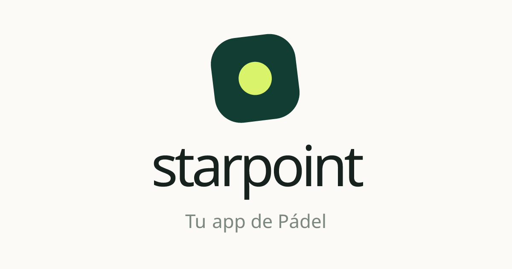

<p align="center">
  
</p>

# starpoint 🎾

**starpoint** es una PWA para un grupo de pádel: mixings semanales con sorteo de parejas, partidos publicados para buscar jugadores, ranking ELO y validación de resultados. Construida con **Next.js 16**, **Supabase** y **Emotion**, pensada solo para móvil.

---

## ✨ Características

### 🔄 Mixing semanal
- Convocatorias con club, fecha, hora, pistas y rondas; inscripción con lista de espera (titulares y reservas por orden de inscripción).
- **Sorteo** de parejas y rivales para todas las rondas del evento, con un algoritmo que prioriza, por este orden: respetar las exclusiones, no repetir pareja ni pista dentro del evento, igualar el nivel de los partidos y, por último, no repetir lo del evento anterior. Las posiciones drive y revés sirven de desempate.
- El admin elige las pistas del club que se usan ese día, genera (o vuelve a generar) el sorteo, revisa un resumen de reencuentros y avisos, y lo publica de una vez.
- **Cron semanal**: cada miércoles a las 22:00 (hora de España) se crea el evento de la semana siguiente en Padel Indoor, con manejo del cambio de hora verano/invierno.
- Los jugadores ven los cambios en tiempo real, sin recargar.

### ➕ Partidos
Cualquier jugador puede publicar un **partido** (club, fecha, hora y cuántos jugadores busca, de 1 a 3) para completar sus 4 jugadores y 90 minutos. Se avisa al grupo por notificación push, aparece en "Lo que viene" y los demás se apuntan o se borran. Sin sorteo ni resultados. El organizador puede editarlo o cancelarlo; desaparece al terminar.

### ⚔️ Resultados y ranking
- Cada jugador ve **solo su partido** del sorteo. El resultado se guarda como **juegos totales** (sin sets).
- Un jugador introduce el marcador, el rival lo confirma o lo corrige ("Hay un error en el marcador"). Si pasan 24 horas sin respuesta se confirma el último marcador; los partidos sin resultado caducan sin puntuar.
- **ELO adaptado a pádel dobles**: K dinámico (nuevos jugadores frente a veteranos), peso del margen del resultado, filtro de disparidad y amortiguación en el extremo superior (parámetros en `src/lib/config.ts`). El cálculo y la actualización de los 4 perfiles, el historial y el estado del partido ocurren en una única transacción de PostgreSQL (`confirm_match_atomic`).
- Historial con estadísticas y partidos coloreados por resultado.
- Los niveles de los demás **solo los ve el admin**: los jugadores ven la mano (revés, drive o ambos) de cada uno.

### 🛠️ Roles
| Rol | Capacidades |
|---|---|
| **Jugador** | Inscribirse a mixings y partidos, publicar partidos, introducir y confirmar resultados, ver su historial |
| **Admin** | Todo lo anterior, más: crear y editar eventos, gestionar participantes e invitados, sorteo, partidos pendientes de todo el grupo, exclusiones y jugadores |

Un admin empieza en la **vista de jugador** y cambia a la de administración desde el menú del avatar. El registro de usuarios está cerrado: solo existen cuentas creadas por un admin.

### ⚡ Tiempo real y PWA
Supabase Realtime en eventos, partidos e inscripciones; notificaciones push; instalable en pantalla de inicio.

---

## 🏗️ Stack

| Capa | Tecnología |
|---|---|
| Frontend | Next.js 16 (App Router), React 19 |
| Estilos | Emotion (tema claro y oscuro en `src/theme.ts`) |
| Backend / BD | Supabase (PostgreSQL, Auth, Realtime, RLS) |
| Despliegue | Vercel (cron semanal); `pg_cron` de Supabase para el cierre automático |
| Formularios | React Hook Form + Zod v4 |
| Iconos | Lucide React |

---

## 📁 Estructura relevante

```
src/
├── app/                  # Rutas: / · /mixing · /partido · /events/[id] · /history · /profile · /admin/*
│   ├── actions/          # Server Actions (events, matches, mixing-generator, admin-*, users…)
│   └── api/cron/         # create-weekly-event, close-pending-matches
├── components/
│   ├── atoms/            # Button, Input, Avatar, Select, Switch…
│   ├── molecules/        # Header, TabBar, Dialog, PlayerList, CourtCard…
│   └── organisms/        # EventOpenView, EventDrawView, EventGenerator, MatchEventView…
├── lib/                  # rating-logic, mixing-algorithm, confirm-match, event-draw, match-events…
└── theme.ts              # Tokens de diseño
```

Más contexto técnico (reglas de privacidad, base de datos, convenciones y flujo de trabajo) en [AGENT.md](AGENT.md).

---

## 🚀 Instalación local

```bash
# 1. Clonar
git clone https://github.com/amat3/star-point.git
cd star-point

# 2. Instalar dependencias
npm install

# 3. Variables de entorno: crea .env.local con las claves de abajo

# 4. Desarrollo
npm run dev
```

### Variables de entorno necesarias

```env
NEXT_PUBLIC_SUPABASE_URL=https://xxxx.supabase.co
NEXT_PUBLIC_SUPABASE_ANON_KEY=eyJ...
SUPABASE_SERVICE_ROLE_KEY=eyJ...      # solo servidor: operaciones de admin y cron
CRON_SECRET=...                       # protege /api/cron/*
NEXT_PUBLIC_VAPID_PUBLIC_KEY=...      # notificaciones push
VAPID_PRIVATE_KEY=...
VAPID_SUBJECT=mailto:...
```

### Base de datos
Las migraciones están en la raíz del repositorio (`supabase_*.sql`) y se aplican a mano en Supabase, en el orden de su fecha de creación. Algunas están pendientes de aplicar en producción; consulta [AGENT.md](AGENT.md).

---

## ✅ Tests y CI

- **Vitest** para la lógica pura de mayor riesgo: ELO (`rating-logic.test.ts`), algoritmo de sorteo (`mixing-algorithm.test.ts`) y utilidades de fechas y rondas (`utils.test.ts`).
- `npm run test` (una vez) / `npm run test:watch` (modo watch).
- **GitHub Actions** (`.github/workflows/ci.yml`) ejecuta en cada push a `main` y en cada PR: `tsc --noEmit` → `eslint` → `vitest run` → `next build`.
- Fuera de alcance por ahora: tests E2E y de server actions que hablan con Supabase.

---

## ⚙️ Configuración del sistema de rating

Los parámetros del ELO se centralizan en `src/lib/config.ts`:

```ts
K_PROVISIONAL: 0.40   // K para jugadores con < 10 partidos
K_ESTABLISHED: 0.15   // K para jugadores establecidos
PROVISIONAL_LIMIT: 10 // Partidos para considerarse establecido
DISPARITY_FULL: 1.0   // Gap ≤ 1.0 → partido vale 100%
DISPARITY_ZERO: 2.5   // Gap ≥ 2.5 → partido vale 0%
DAMPENING_START: 4.5  // Desde aquí se reduce la volatilidad
DAMPENING_END: 6.5    // Aquí K queda al 60%
MATCH_WEIGHT: 0.70    // Peso del margen del resultado (subido desde 0.40 en jul-2026)
MIN_RATING: 0
MAX_RATING: 7
INITIAL_RATING: 3.5
```

Un cambio de parámetros puede recalcularse con carácter retroactivo sobre todo el historial con `src/scripts/retroactive-match-weight.ts` (dry-run por defecto).

---

Creado con ❤️ para la comunidad de pádel.
